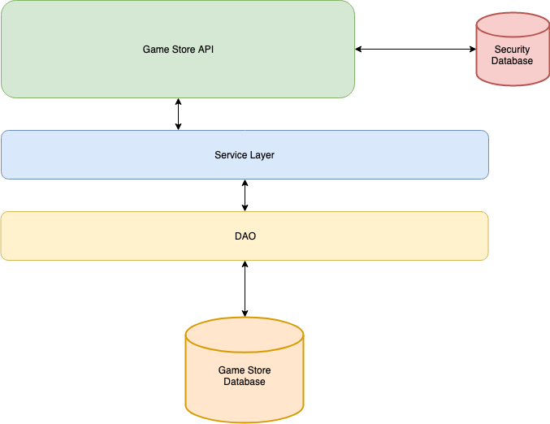
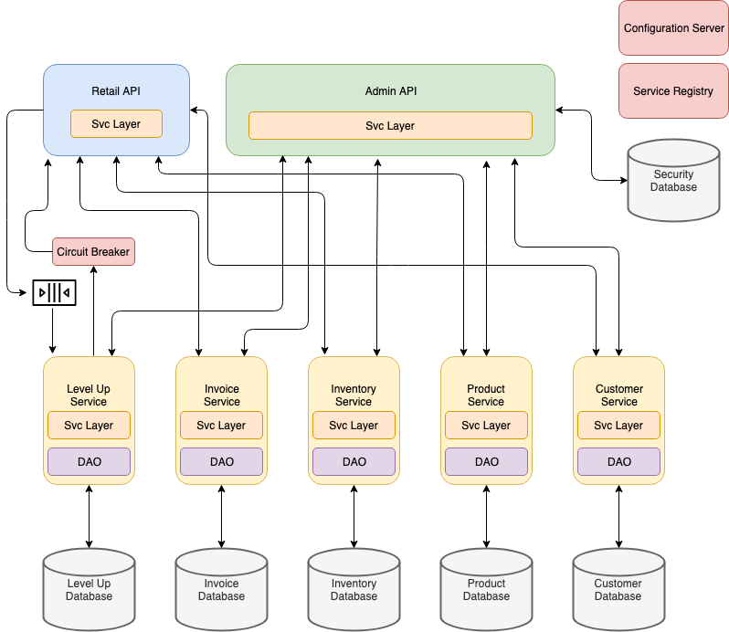

# Cloud Native Game Store Project

Your company has decided to move forward with a Game Store API project. This set of REST APIs will support both web and mobile clients for customers. The original project was designed and implementation was started before the company began moving toward a cloud-native architecture. The original design is a traditional monolithic application with a single database. You have been asked to move the current design and partial implementation to a design that follows the company's new cloud-native architectural standards.

## Structure
Your solution must have the following structural elements:

* Each service (plus the Configuration Server and the Service Registry) must be in a separate IntelliJ IDEA project.
* Your project must be built using Spring Boot and Spring MVC. Initialize your project using ```start.spring.io```

## Methodology
* You must manage your project using Pivotal Tracker
* You must determine an iteration length and plan the project accordingly 
* You must translate all application requirements into stories 
* You must build your application feature by feature 
* You must have demonstrable, working, production quality code at the end of each iteration 
* You must use Test-Drive Development (TDD) 

## Design

This section contains a high level overview of the original design and the new cloud-native design that you will implement.

### Original Design

The original design of the system was a traditional monolithic application that had one database with all features integrated into a single service. There is very little documentation of the system beyond the diagram and database creation script below.

There is no documentation of the API but a shell implementation of the controller containing all of the API endpoints exists. You must use that code as your documentation.





```sql
create schema if not exists cloud_game_store;
use cloud_game_store;

create table if not exists product (
	product_id int(11) not null auto_increment primary key,
    product_name varchar(50) not null,
    product_description varchar(255) not null,
    list_price decimal(7,2) not null,
    unit_cost decimal(7,2) not null
);

create table if not exists inventory (
	inventory_id int(11) not null auto_increment primary key,
    product_id int(11) not null,
    quantity int(11) not null
);

create table if not exists customer (
	customer_id int(11) not null auto_increment primary key,
    first_name varchar(50) not null,
    last_name varchar(50) not null,
    street varchar(50) not null,
    city varchar(50) not null,
    zip varchar(10) not null,
    email varchar(75) not null,
    phone varchar(20) not null
);

create table if not exists invoice (
	invoice_id int(11) not null auto_increment primary key,
    customer_id int(11) not null,
    purchase_date date not null
);

create table if not exists invoice_item (
	invoice_item_id int(11) not null auto_increment primary key,
    invoice_id int(11) not null,
    inventory_id int(11) not null,
    quantity int(11) not null,
    unit_price decimal(7,2) not null    
);

create table if not exists level_up (
	level_up_id int(11) not null auto_increment primary key,
    customer_id int(11) not null,
    points int(11) not null,
    member_date date not null
);

alter table inventory add constraint fk_inventory_product foreign key (product_id) references product(product_id);
alter table invoice add constraint fk_invoice_customer foreign key (customer_id) references customer(customer_id);
alter table invoice_item add constraint fk_invoice_item_invoice foreign key (invoice_id) references invoice(invoice_id);
alter table invoice_item add constraint fk_invoice_item_inventory foreign key (inventory_id) references inventory(inventory_id);
alter table level_up add constraint fk_level_up_customer foreign key (customer_id) references customer(customer_id);
```


### Cloud-Native Design

The design incorporates many elements of a modern cloud-native architecture including:

* Configuration Server
* Service Registry
* Queues
* Circuit Breaker
* Caching
* Micoservices
* Backend for Frontend (BFF) edge services




#### Database Scripts

These are the SQL creation scripts you must use to create the databases behind each of the microservices.

##### Level Up

```sql
create schema if not exists level_up;
use level_up;

create table if not exists level_up (
	level_up_id int(11) not null auto_increment primary key,
    customer_id int(11) not null,
    points int(11) not null,
    member_date date not null
);
```

##### Invoice

```sql
create schema if not exists invoice;
use invoice;

create table if not exists invoice (
	invoice_id int(11) not null auto_increment primary key,
    customer_id int(11) not null,
    purchase_date date not null
);

create table if not exists invoice_item (
	invoice_item_id int(11) not null auto_increment primary key,
    invoice_id int(11) not null,
    inventory_id int(11) not null,
    quantity int(11) not null,
    unit_price decimal(7,2) not null    
);

alter table invoice_item add constraint fk_invoice_item_invoice foreign key (invoice_id) references invoice(invoice_id);
```

##### Inventory

```sql
create schema if not exists inventory;
use inventory;

create table if not exists inventory (
	inventory_id int(11) not null auto_increment primary key,
    product_id int(11) not null,
    quantity int(11) not null
);
```

##### Product

```sql
create schema if not exists product;
use product;

create table if not exists product (
	product_id int(11) not null auto_increment primary key,
    product_name varchar(50) not null,
    product_description varchar(255) not null,
    list_price decimal(7,2) not null,
    unit_cost decimal(7,2) not null
);
```

##### Customer

```sql
create schema if not exists customer;
use customer;

create table if not exists customer (
	customer_id int(11) not null auto_increment primary key,
    first_name varchar(50) not null,
    last_name varchar(50) not null,
    street varchar(50) not null,
    city varchar(50) not null,
    zip varchar(10) not null,
    email varchar(75) not null,
    phone varchar(20) not null
);
```

##### Security

```sql
create schema if not exists spring_security;
use spring_security;

create table if not exists users(
	username varchar(50) not null primary key,
	password varchar(100) not null,
	enabled boolean not null
);

create table if not exists authorities (
	username varchar(50) not null,
	authority varchar(50) not null,
	constraint fk_authorities_users foreign key(username) references users(username));
	create unique index ix_auth_username on authorities (username,authority
);

```


## Features and Functional Requirements

This section contains all of the functional requirements of the system.

### Retail API Service

##### Port

This service runs on port 8181.

##### API

The Retail API is a BFF edge service that contains all API endpoints for searching inventory and purchasing products. This API does not require authentication. This API is not documented. You must pull all of the inventory search and product purchasing endpoint from the existing code, document them in Swagger, and reimplement them in the new Retail API Service.

##### Backing Services

The Retail API Service communicates with the following backing services:

* Level Up
* Order
* Inventory
* Product
* Customer

##### Business Rules

* 10 Level Up points are awarded for each $50 purchased.
* These points are not pro-rated.
  * For example:
    * A $49 order gets zero Level Up points.
    * A $99 order gets 10 Level Up points.
    * A $110 order gets 20 Level Up points.
* Level Up points are submitted when the order is submitted.
* Level Up points totals are returned as part of the completed invoice.
* Order quantity must be greater than zero and less than or equal to the number of items in inventory.
* Orders must contain valid products.
* An order must contain a valid customer.

##### Architecture Requirements

* Level Up points must be submitted to the Level Up service via a queue.
* Level Up total inquiries must be run through a circuit breaker.
* See diagram above.

### Admin API

##### Port

This service runs on port 8282.

##### API

The Admin API is a BFF edge service that contains all the endpoints for CRUD operations of the following:

* Customers
* Products
* Inventory
* Orders
* Level Up Points

This API is not documented and is only partially implemented in the existing code. You must pull out the parts of the API that are implemented in the existing code, model them in Swagger, and reimplement them in the new Admin API service. Use the existing API endpoints as a model for the missing endpoints.

##### Security Rules

The security rules for the Admin API Service are:

* All Admin API endpoints require authentication.
* Admin Role
  * Can access all endpoints.
* Manager Role
  * Can Create, Read, and Update all items in the system.
* Team Lead Role
  * Can Read and Update all items in the system.
  * Can Create Customers in the system.
* Employee Role
  * Can read all items in the system.
  * Can Update Inventory in the system.

### Level Up Service

##### Port

This service runs on port 7001.

##### Description

This is a microservice that contains all CRUD functionality for the Level Up! rewards system. This service has not been designed. You must design and document the API and implement the entire service.

The Read endpoint of the service must have a circuit breaker.

### Invoice Service

##### Port

This service runs on port 7002.

##### Description

This is a microservice that contains all CRUD functionality for Invoices. This service has not been designed, but a shell implementation of the CRUD endoints for Invoices is in the existing code. Find these endpoints, document the endpoints in Swagger and reimplement them in the new Invoice microservice.

### Inventory Service

##### Port

This service runs on port 7003.

##### Description

This is a microservice that contains all CRUD functionality for inventory. This service has not been designed. You must design and document the API and implement the entire service.

### Product Service

##### Port

This service runs on port 7004.

##### Description

This is a microservice that contains all the CRUD functionality for Products. This service contains information on all the Products that the company has sold in the past and may sell in the future. This service does not contain information about current inventory levels. This service has not been designed. you must design and document the API and implement the entire service.

### Customer Service

##### Port

This service runs on port 7005.

##### Description

This is a microservice that contains all the CRUD functionality for Customers. This service has not been designed. you must design and document the API and implement the entire service.

### Configuration Server

##### Port

This service runs on port 9999.

### Service Registry

##### Port

This service runs on port 8761.

## Architectural Requirements

This section contains all of the architectural requirements of the system.

### Configuration Server

All services in the system must use the Configuration Server for all of their configuration files.

### Service Registry

All backing services must register with the Service Registry. The Retail API and Admin API web services must use the Service Registry to locate the backing services that they use.

### Spring Security

The Admin API must be protected by Spring Security (roles and access rules are found in the Functional Requirements above).

* You must use the default Spring Security schema.
* All passwords must be hashed with BCrypt

### Interaction with Backing Services

Communication to backing services from the Retail API and Admin API web services must be done using Feign clients in a Service Layer component.

### Database Interaction

All DAOs must use JdbcTemplates and Prepared Statements.

### Caching

You must incorporate caching as appropriate in the application. Be prepared to explain your design decisions.

### Error Handling

* You must implement ControllerAdvice to handle exceptions and return propery HTTP status codes and data when exception occur. This includes handling all violoations of business rules.
* You must use JSR 303 validation where appropriate

### Jenkins CI/CD

Each service in the system must have its own Jenkins pipline. Each pipeline must have at least three stages:

1. Build
2. Test
3. Deliver

NOTE: Use the Jenkins WAR installation instructions found here: https://jenkins.io/doc/book/installing/. This will allow your Jenkins instance to access your local MySQL server so you can run integration tests during your Test stage.

### Documentation

Your REST APIs must be documented with Swagger.

## Hints

* Set up your infrastructure first. This includes:
  * Configuration Service
  * Service Registry
* Next,set up the Retail API and Admin API Web Services with stub implementations for controller endpoints.
* Implement Retail and Admin API endpoints (aka user stories) one at a time including all required  backing services and associated databases. Incorporate the configuration service, service registry, caching, queues, and circuit breakers where needed as you go.
* You should deliver one or more feature complete Retail/Admin endpoints at the end of each project iteration.
* Add Spring Security to the endpoints of the Admin API after all features are working properly.


